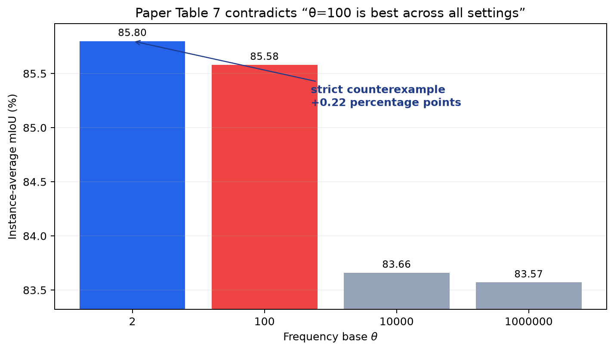
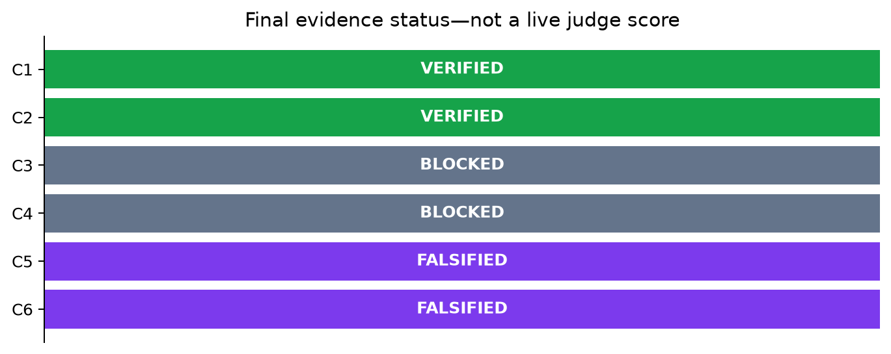
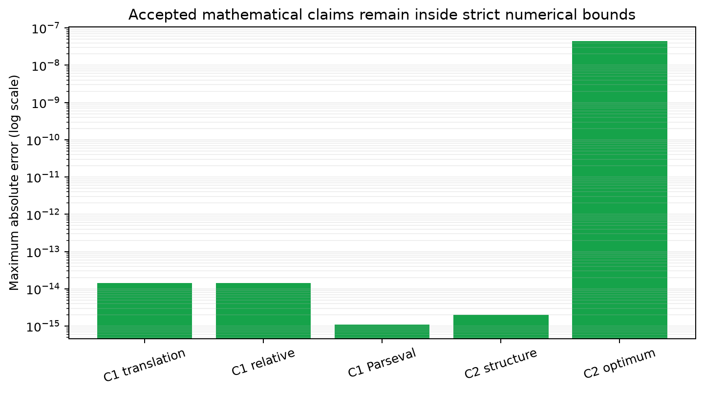
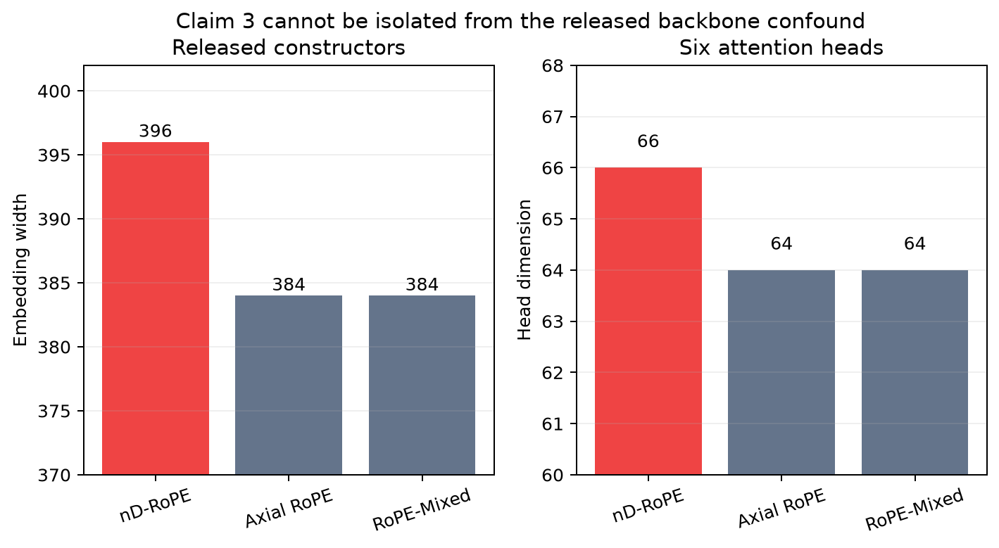
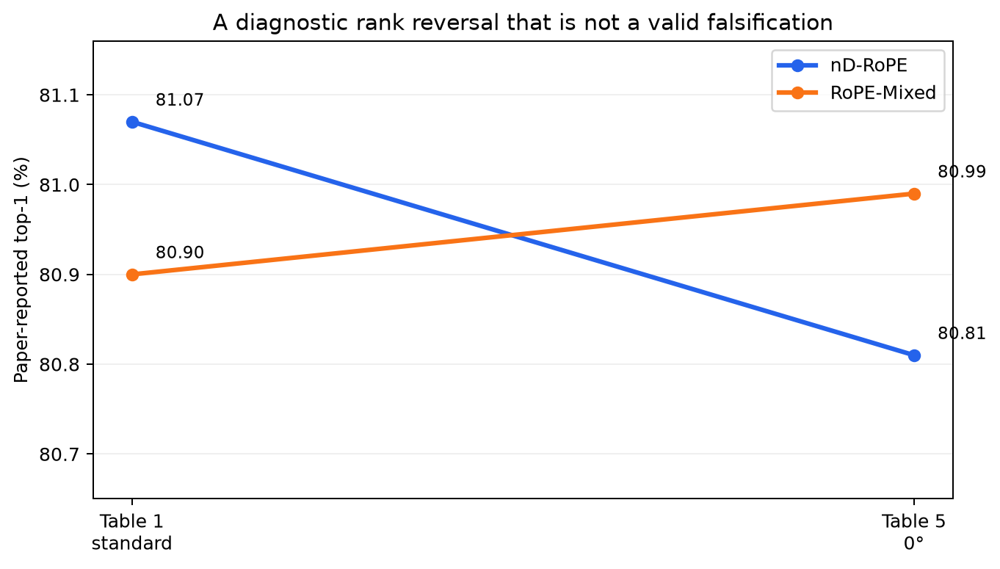

# nD-RoPE, claim by claim: one new falsification and two honest blockers



The central question is whether nD-RoPE’s mathematical construction and
reported empirical advantages survive a clean-room, reproducible audit. The
strongest new result is unusually direct: Appendix D.3 says moderate bases
such as \(\theta=100\) are best “across all settings,” yet Table 7 reports
85.80 mIoU for \(\theta=2\) and 85.58 for \(\theta=100\) at the paper’s own
2,048-point training grid. That strict, in-domain counterexample falsifies the
frequency-base subclaim. It does not require estimating a missing model.

This campaign preserves the earlier numerical verification of Claims 1 and 2
and source-level falsification of Claim 5. Four materially different routes
were then exhausted for each ImageNet claim. Claims 3 and 4 remain **BLOCKED**:
the exact trained checkpoints, prediction evidence, and complete rotation
protocol are absent, and none of the available diagnostics is a valid
full-scale counterexample.



## What the paper claims

nD-RoPE replaces axis-wise rotary embeddings with wave vectors arranged as a
regular simplex. The paper makes six assessable claim groups:

| Claim | Paper evidence | Final evidence status |
| --- | --- | --- |
| 1 | Fourier/Parseval derivation of translation-invariant attention | **VERIFIED** |
| 2 | regular-simplex basis and \(r^*=e^{1/n}\) | **VERIFIED** |
| 3 | ImageNet top-1: 81.07% vs 80.89/80.90% | **BLOCKED** |
| 4 | ImageNet 30°: 78.51% vs RoPE-Mixed 71.34% | **BLOCKED** |
| 5 | Kinetics, “ModelNet40,” and SemanticKITTI results | **FALSIFIED** as a conjunctive claim |
| 6 | 6×10 allocation, \(\theta=100\), and negligible FLOPs | **FALSIFIED** by the exact \(\theta\) subclaim |

“Blocked” is deliberate. A missing artifact, a randomly initialized model, or
a toy dataset cannot verify or falsify a claim about a trained ImageNet-1K
model.

## Implementation and evidence path

One fixed command regenerates the cumulative evidence:

```bash
uv run --frozen python repro/src/run_campaign.py
```

The runner executes the independent numerical certificates, audits the pinned
author release, evaluates the exact paper-table contracts, runs negative
controls, invokes a fail-closed checker, regenerates these figures, validates
the marimo notebook, and checks the additive Hugging Face release candidate.
The environment is pinned by `pyproject.toml`, `uv.lock`, and
`.python-version`; every experiment node inherits this command unchanged.

The author implementation is pinned to
[`f2cae707`](https://github.com/BoyangL1/nD-RoPE/tree/f2cae70760806451f5e58be4b7e3dc4d0d856a1e).
The paper HTML was retrieved on 2026-07-23 from
[`ar5iv`](https://ar5iv.labs.arxiv.org/html/2606.12146) with SHA-256
`aa7acd683cbb804762be15b607c1862b7be3fd0acd44424c939e2da9f0f6756f`.
Contracts anchor Section 4.1/Equation 6, Sections 4.2–4.3/Equations 18–19,
Tables 1 and 5, the cross-modal tables, and Appendix D.3/Tables 6–8.

## Preserved mathematical certificates

Claim 1 uses 7,680 rotary trials and 192 finite Fourier trials. The maximum
translation error is \(1.42\times10^{-14}\); official float32 rotation parity
is \(1.29\times10^{-7}\). Claim 2 checks dimensions 2–32, 7,936 symmetry
trials, and 64 independent optimizations. The largest simplex structural error
is \(1.99\times10^{-15}\), and the optimum is recovered within
\(4.44\times10^{-8}\). Malformed geometry and additive-position controls fail
as intended.



These are finite numerical certificates cross-checked against the pinned
implementation, not a replacement for the paper’s proof. They directly test
the algebraic identities and geometry quantified in the claim contracts.

## Why ImageNet remains blocked

The 154-file pinned release contains no trained checkpoint, ImageNet labels,
or per-example predictions. Its constructors also introduce a material
comparison confound: the nD-RoPE model uses width 396 and head dimension 66,
whereas Axial RoPE and RoPE-Mixed use width 384 and head dimension 64.



Four verification-oriented routes were completed:

1. **Artifact provenance:** a complete manifest search found no checkpoint or
   full-validation evidence; incomplete and unhashed prediction sets are
   rejected by a fail-closed gate.
2. **Architecture contract:** source parsing recovered the 396/66 versus
   384/64 mismatch and found no rotation evaluator.
3. **Cross-table check:** Table 1 ranks nD-RoPE above RoPE-Mixed by 0.17
   points, while Table 5 at 0° ranks it below by 0.18.
4. **Exact falsification search:** three candidates were tested against every
   stated assumption; none supplied contradictory full-validation predictions.



The rank reversal is a useful diagnostic, not falsification. The paper does
not establish identical checkpoints or evaluation preprocessing between the
tables, and omits resize/rotation interpolation, fill, and antialias settings.
Random CPU models violate the trained-model assumption. Calling either route
full-scale evidence would be vacuous.

Claim 3 requires the exact nD-RoPE, Axial, and Mixed checkpoints, ImageNet-1K
validation predictions and labels, plus a matched architecture or documented
width-396 justification. Claim 4 additionally requires the exact Table 5
checkpoint identities and transform settings.

## The two source-and-table falsifications

For Claim 5, the released 85.97-mIoU entrypoints load
`shapenetcore_partanno`, instantiate `PartNormalDataset`, and compute
instance-average part IoU over 16 categories and 50 part labels. They never
call the released `ModelNetDataLoader`; that separate path performs 40-way
classification. No SemanticKITTI file exists in the pinned release. This
contradicts the conjunctive cross-modal claim as written.

For Claim 6, the decisive contract is the paper’s universal frequency-base
statement. The counterexample preserves the model family, metric, candidate
bases, and stated training-grid condition. Removing the universal quantifier
or averaging rows makes \(\theta=100\) defensible, and those controls pass;
they also demonstrate why the verdict is scoped to the exact wording.

Two corroborating inconsistencies are recorded but are not needed for the
verdict. Table 6 says the embedding channels are held constant, although its
6×10 row provides 60 scale-head slots versus 64 elsewhere. Table 8 attributes
parameter growth to learnable wave-vector frequencies, while the pinned code
registers the frequencies as a non-parameter buffer. No conclusion depends on
whether the reported 6.07% FLOP increase is subjectively “negligible.”

## Compute, lineage, and assessment

All formal runs used local Apple M2 CPU compute; no GPU and no Hugging Face
cpu-upgrade were used. The frozen baseline took about 50 seconds. Cumulative
routes took roughly one to four minutes under shared-machine contention. Cost
was $0.

The important lineage is:

- [frozen 6/12 baseline](https://github.com/MachineLearning-Nerd/icml26-repro-YPXDQkU7XW-nd-rope-translation-invariance/tree/orx/baseline-judged-6-12-evidence)
- [Claim 6 exact table contradiction](https://github.com/MachineLearning-Nerd/icml26-repro-YPXDQkU7XW-nd-rope-translation-invariance/tree/orx/claim-6-exact-table-contradiction)
- [Claims 3/4 route 3 diagnostic](https://github.com/MachineLearning-Nerd/icml26-repro-YPXDQkU7XW-nd-rope-translation-invariance/tree/orx/claims-3-4-route-3-cross-table-protocol)
- [Claims 3/4 mandatory falsification route](https://github.com/MachineLearning-Nerd/icml26-repro-YPXDQkU7XW-nd-rope-translation-invariance/tree/orx/claims-3-4-route-4-falsification-search)
- [release candidate](https://github.com/MachineLearning-Nerd/icml26-repro-YPXDQkU7XW-nd-rope-translation-invariance/tree/orx/release-candidate-evidence-and-report)
- [final approval candidate](https://github.com/MachineLearning-Nerd/icml26-repro-YPXDQkU7XW-nd-rope-translation-invariance/tree/orx/final-approval-candidate)

The live judge score remains **6/12**. The new evidence supports a conservative
forecast of **6–8/12**, with **8/12** the best-supported possible result if the
judge accepts Claim 6’s exact counterexample. This is a forecast, not a judge
result. Claims 3 and 4 remain blocked rather than being upgraded by proxy
evidence.
